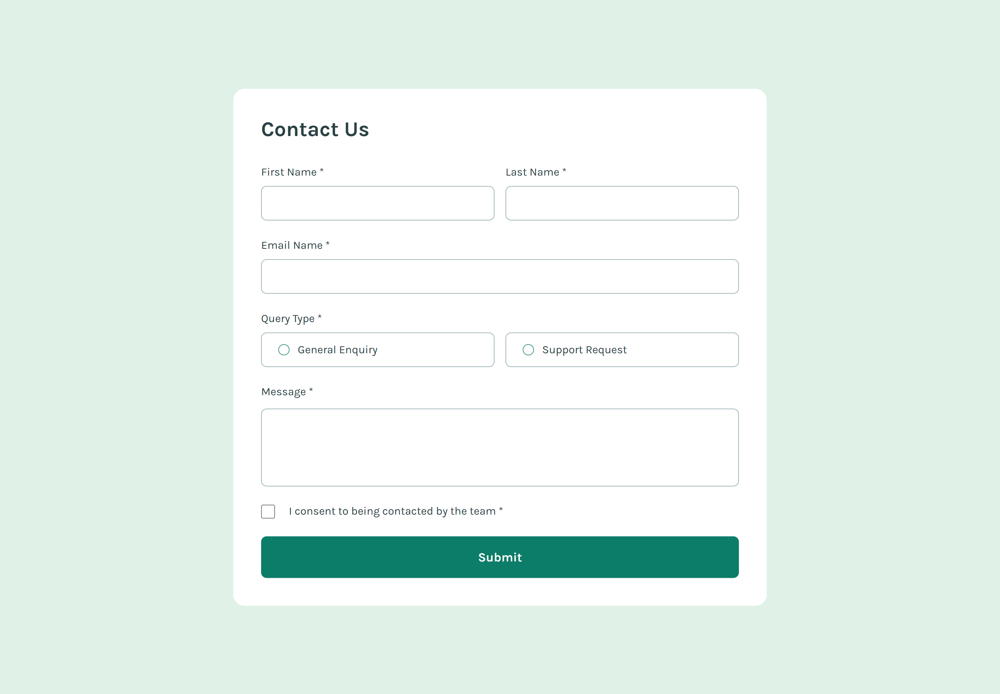

# Frontend Mentor - Contact form solution

This is a solution to the [Contact form challenge on Frontend Mentor](https://www.frontendmentor.io/challenges/contact-form--G-hYlqKJj).

## Table of contents

- [Overview](#overview)
  - [The challenge](#the-challenge)
  - [Screenshot](#screenshot)
  - [Links](#links)
- [My process](#my-process)
  - [Built with](#built-with)
  - [What I learned](#what-i-learned)
  - [Continued development](#continued-development)
  - [Useful resources](#useful-resources)
- [Author](#author)

## Overview

### The challenge

Users are able to:

- Complete the form and see a success toast message upon successful submission
- Receive form validation messages if:
  - A required field has been missed
  - The email address is not formatted correctly
- Complete the form only using their keyboard
- Have inputs, error messages, and the success message announced on their screen reader
- View the optimal layout for the interface depending on their device's screen size
- See hover and focus states for all interactive elements on the page

### Screenshot



### Links

- Solution URL: [Add solution URL here](https://your-solution-url.com)
- Live Site URL: [Add live site URL here](https://your-live-site-url.com)

## My process

### Built with

- Semantic HTML5 markup
- CSS custom properties
- Flexbox
- CSS Grid
- Mobile-first workflow
- PHP
- [Tailwind-CSS](https://tailwindcss.com/) - For styles

### What I learned

This was my first time using PHP to build anything and I enjoyed it. There were quite a few things I learned by doing this project.

One of main things I learned was how to implement form validation in general, sanitise the user input values for inhanced security and prevent malicious code being inserted, as welll as how to deal with basic PHP forms in general. I sanitised the inputs by using methods like "htmlentities()", which made sure if someone inserted any scripts, the script would be converted into html entities. You could also use a method like "htmlspecialchars()" which would convert whatever is inputed into html escaped code. These would ensure that the code would now be safe to display on the page:

```php
htmlentities($_POST[$name])
// OR
htmlspecialchars($_POST[$name])
```

<br>

I learn't about things like superglobals in PHP and how to use some of them. For example, the main one I used was "$_POST" variable. I used this to grab the forms input values, after the form had been submitted through a "POST" method request. I could then perform the validation I need to on the values. I also used the "$_SERVER" variable to get the request method that the form was using, performed the validation when the form used the "POST" method.

```php
$_SERVER["REQUEST_METHOD"]
// &
$_POST["first-name"]
```

<br>

There were many other things I learn't while building this project. Like using associative arrays, keeping the input values even after submission, & using specfic PHP tags to handle outputing HTML under conditions or using loops.

In this project I used the "$_POST" superglobal to grab the form value, if one exists, from the form submitted previously, then set it back as the inputs value. I know that this probably isn't the best way to do this and I did some research and found that this is best done using a session, to store the forms submission status in some temporary state and use it from there but I felt it was a bit of an overkil for this project. Although, when I do this again in a future porject, this is how I would implement it. 

Here is the code I used to keep the input values after submisions:
```php
<input
  value="<?= isset($_POST[$inputName]) ? htmlentities($_POST[$inputName]) : "" ?>"
>
```

Here are some PHP tags we can use to output HTML under conditions or iterations:
```php

  <?php if (isset($value)): ?>
    // ... code
  <?php endif; ?>

  <?php foreach ($array as $key => $value): ?>
    /// ... code
  <?php endforeach; ?>

```

<br>

This is the "form.php" file, which I built using different partial files, I tried to split the code up into some sort of re-usable components for the forms inputs. Most of the validation logic is written at the top of this file. I will learn more about how to structure the logic in a php application in the future. Which will be probably be through classes & different design patterns but I think this will do for this project, although the code is a bit of a mess:

```php
<?php


$errorsList = [];
$isSuccesfulSubmit = false;


function checkInput($input)
{
  $input = trim($input);
  $input = stripslashes($input);
  $input = htmlspecialchars($input);
  return $input;
}


function resetInputs()
{
  $_POST["first-name"] = "";
  $_POST["last-name"] = "";
  $_POST["email"] = "";
  $_POST["query-type"] = null;
  $_POST["message"] = "";
  $_POST["contact-consent"] = null;
};


if ($_SERVER["REQUEST_METHOD"] === "POST") {


  $inputs = [
    "first-name" => checkInput($_POST["first-name"]),
    "last-name" =>  checkInput($_POST["last-name"]),
    "email" => checkInput($_POST["email"]),
    "query-type" => isset($_POST["query-type"]) ? checkInput($_POST["query-type"]) : null,
    "message" => checkInput($_POST["message"]),
    "contact-consent" => isset($_POST["contact-consent"]) ? checkInput($_POST["contact-consent"]) : null,
  ];


  foreach ($inputs as $key => $value) {
    if (empty($value)) {
      $errorsList[$key] = "This field is required";
    }
    if ($key === "query-type" && !$value) {
      $errorsList["query-type"] = "Please select a query type";
    }
    if ($key === "email" && !filter_var($value, FILTER_VALIDATE_EMAIL)) {
      $errorsList["email"] = "Please enter a valid email address";
    }
    if ($key === "contact-consent" && !$value) {
      $errorsList["contact-consent"] = "To submit this form, please consent to being contacted";
    }
  }


  if (empty($errorsList)) {
    $isSuccesfulSubmit = true;
    resetInputs();
  };
}
?>

<form method="POST" class="w-full mt-8 grid gap-6 smTablet:grid-cols-twoCols smTablet:gap-x-4">

  <?php if ($isSuccesfulSubmit) : ?>
    <?php include __DIR__ . "/successModal.php"; ?>
  <?php endif; ?>


  <?php
  $inputId = "first-name";
  $inputName = "first-name";
  $label = "First Name";
  $isTwoCols = false;
  include __DIR__ . "/form-partials/textInput.php";
  ?>

  <?php
  $inputId = "last-name";
  $inputName = "last-name";
  $label = "Last Name";
  $isTwoCols = false;
  include __DIR__ . "/form-partials/textInput.php";
  ?>

  <?php
  $inputId = "email";
  $inputName = "email";
  $label = "Email Name";
  $isTwoCols = true;
  include __DIR__ . "/form-partials/textInput.php";
  ?>

  <fieldset class="smTablet:col-start-1 smTablet:col-end-3">

    <legend for="query-type">
      Query Type *
    </legend>

    <div class="w-full mt-2 flex flex-col gap-4 smTablet:flex-row">
      <?php
      $name = "query-type";
      $label = "General Enquiry";
      $id = "general-enquiry";
      $value = "general-enquiry";
      include __DIR__ . "/form-partials/radioInput.php";
      ?>
      <?php
      $name = "query-type";
      $label = "Support Request";
      $id = "support-request";
      $value = "support-request";
      include __DIR__ . "/form-partials/radioInput.php";
      ?>
    </div>

    <?php if (isset($errorsList[$name])): ?>
      <div class="w-full mt-2 col-start-1 col-end-[-1]">
        <p class="text-sm text-red"><?= $errorsList[$name] ?></p>
      </div>
    <?php endif; ?>

  </fieldset>

  <?php
  $name = "message";
  $label = "Message";
  $id = "message";
  include __DIR__ . "/form-partials/textareaInput.php";
  ?>

  <?php
  $name = "contact-consent";
  $label = "I consent to being contacted by the team";
  $id = "contact-consent";
  include __DIR__ . "/form-partials/checkboxInput.php";
  ?>

  <button
    type="submit"
    <?= $isSuccesfulSubmit ? "disabled" : "" ?>
    class="p-4 rounded-lg bg-brightGreen text-center hover:bg-darkGrey text-white font-semibold text-lg active:bg-darkGrey disabled:opacity-50 disabled:hover:bg-brightGreen smTablet:col-start-1 smTablet:col-end-3">
    Submit
  </button>

</form>
```

<br>

#### Some small reminders to myself

I used this script to set up tailwindCSS and have it to watch for changes, then output them to the local CSS file:
```json
"css:build": "npx tailwindcss -i ./public/css/input.css -o ./public/css/styles.css --minify",
"watch": "npx tailwindcss -i ./public/css/input.css -o ./public/css/styles.css --watch --minify"
```

<br>

I used the CSS animation property, instead of transition, because it allowed me to add an animation to the successful toast message, without using any javascript. When I tried adding a class with transition in javascript, the dom element loaded after the javascript applied the class to element, which means it didn't transition because it already had the class applied. Using the animation solved this problem because when the element loaded, the css animation would then run, giving us the drop in effect I wanted for the toast.

Heres the animation I used for the success message toast.
```css
.success-message-ani {
  animation: dropFade 0.5s ease-out forwards, fadeOut 0.5s ease-in 3s forwards;
}

/* Drop down animation */
@keyframes dropFade {
  from {
    transform: translateX(-50%) translateY(-50px);
    opacity: 0;
  }
  to {
    transform: translateX(-50%) translateY(0);
    opacity: 1;
  }
}

/* Fade out animation */
@keyframes fadeOut {
  to {
    opacity: 0;
  }
}
```

<br>


### Continued development

This was only a small project I used to get a taste of using PHP, and I had fun with it. I am excited to continue building more projects with PHP, learning more about the language and to slowly start building larger, more complex apps and websites with it.

### Useful resources

- [w3schools - PHP Form Validation](https://www.w3schools.com/php/php_form_validation.asp) - This helped me set up validation and sanitise the user input values. This is to help make sure that the user can't input any malicious scripts in the application.

## Author

- Website - [https://www.djhwebdevelopment.com](https://www.djhwebdevelopment.com/)
- Frontend Mentor - [@David-Henery4](https://www.frontendmentor.io/profile/David-Henery4)
- LinkedIn - [David Henery](https://www.linkedin.com/in/david-henery-725458241/)
